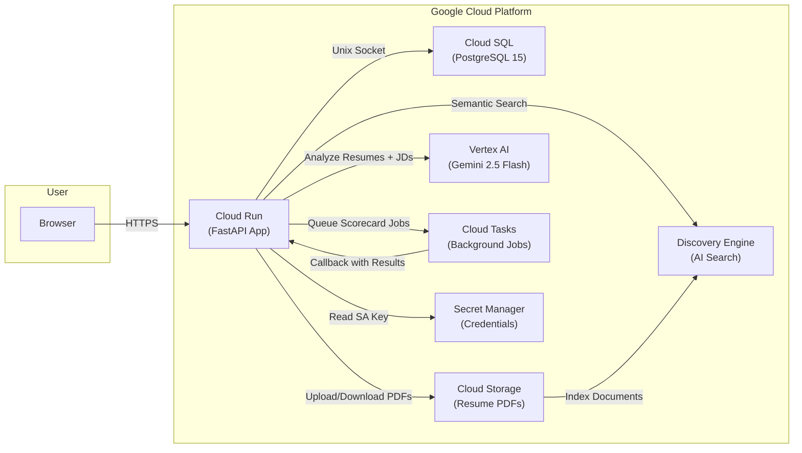
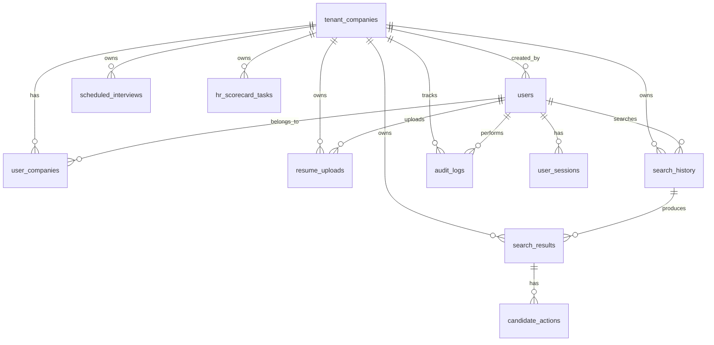

# 🌟 Smart HR: AI-Powered Candidate Search & Analysis Platform

    

**Smart HR** is a production-ready, enterprise-grade AI recruitment platform and Applicant Tracking System (ATS). It allows HR professionals to instantly generate professional Job Descriptions from scratch using AI, upload candidate resumes (PDF/DOCX), let Google's advanced **Gemini 2.5 Flash AI** analyze them, and instantly find the best matches.

The application architecture includes a powerful FastAPI backend, a responsive Vanilla JS and TailwindCSS frontend dashboard, and robust integrations with **Google Cloud Platform** (Cloud Run, Cloud Storage, Vertex AI, Discovery Engine, and Cloud Tasks).

It supports full **multi-tenant data isolation**, allowing you to run this software for multiple companies simultaneously, with subscription limits and separate storage buckets for each.

The codebase is highly optimized, fully documented, and includes a **one-click GCP deployment script** that entirely provisions your cloud infrastructure automatically.

---

## ✨ Feature Highlights

### 📄 Intelligent Document Processing
- **Batch & Single Upload** — Drag-and-drop PDF and DOCX resumes (up to 100MB per file, 500MB batch)
- **Dual-Engine Text Extraction** — `pdfplumber` for structured parsing, `PyPDF2` as fallback, `python-docx` for Word files
- **Auto-Indexing** — Uploaded resumes are automatically indexed into Google Discovery Engine for instant semantic search

### 🤖 AI-Powered HR Scorecard
- **Gemini 2.5 Flash** analyzes each resume against your Job Description
- Produces a detailed **HR Scorecard** per candidate with:
  - Overall match score (0-100%)
  - Entity extraction (name, email, phone, location, experience)
  - Skill keyword matching (matched vs. missing)
  - Strengths & weaknesses analysis
  - Tenure prediction & experience fit analysis
  - Hiring recommendation
- **Background processing** — Large batches run asynchronously via Cloud Tasks; results stream in real-time

### 📝 AI-Powered Job Description Generator
- **Generate JDs from scratch** — Provide a role title, department, location, and experience level. Gemini generates a complete, professional Job Description with:
  - Company overview
  - Position summary
  - Key responsibilities (5-7 bullet points)
  - Required & preferred qualifications
  - Technical and soft skills
  - Benefits & application instructions
- **Enhance existing JDs** — Paste a rough draft and let AI improve clarity, structure, keyword density, and candidate appeal
- **Auto-Extract JD Keywords** — Automatically extracts searchable keywords (hard skills, tools, methodologies, certifications, domain expertise) from any JD for matching

### 🔍 Semantic Candidate Search
- Natural language queries (e.g., *"Senior Python developer with 5 years of AWS experience"*)
- Google Discovery Engine performs **vector similarity search** across all indexed resumes
- Results ranked by relevance score with full candidate details

### 🏢 Multi-Tenant Architecture
- **3 user roles:** Super Admin → Company Admin → HR User
- Each company gets **isolated resources**: dedicated GCS bucket, dedicated Discovery Engine datastore, separate DB rows
- Subscription controls: configurable limits for users, resume count, and search quotas per company

### 📊 Candidate Pipeline Management
- **Shortlist / Reject / Interview / Hire** workflow per candidate
- Schedule interviews with date, time, type, interviewer, and notes
- Full search history with exportable results

### 🔐 Enterprise Security
- `bcrypt`-hashed passwords (12 rounds)
- Secure cookie-based session tokens with expiry
- File upload size middleware (413 rejection for oversized uploads)
- Full **audit log** of every action (who did what, when, with JSONB diff)

---

## 🏗️ Architecture Overview



---

## 🛠️ Technology Stack

| Layer | Technology | Purpose |
|---|---|---|
| **Backend** | Python 3.11, FastAPI, Uvicorn | REST API + Server-Side Rendering |
| **Frontend** | HTML5, CSS3, Vanilla JS, Jinja2 | Dashboard, Login, Search UI |
| **Database** | PostgreSQL 15 (Cloud SQL) | Structured data, sessions, audit logs |
| **AI Engine** | Vertex AI (Gemini 2.5 Flash) | Resume scoring, entity extraction |
| **Search** | Discovery Engine (Vector Search) | Semantic resume indexing & retrieval |
| **Storage** | Google Cloud Storage | PDF/Docx file storage per tenant |
| **Async Queue** | Google Cloud Tasks | Background scorecard processing |
| **Secrets** | Secret Manager | Service account key storage |
| **Container** | Docker (multi-stage build) | Lightweight production image |
| **Hosting** | Cloud Run (auto-scaling) | Serverless container deployment |

---

## 🗄️ Database Schema (11 Tables)

All tables are auto-created by the included `deploy/schema.sql` migration script.



| Table | Purpose | Key Fields |
|---|---|---|
| `tenant_companies` | Company tenants with subscription plans | `company_code`, `max_users`, `gcs_bucket_name`, `datastore_id` |
| `users` | All user accounts (admins + HR users) | `email`, `password_hash`, `user_type` |
| `user_companies` | Many-to-many user ↔ company mapping | `user_id`, `company_id`, `role` |
| `user_sessions` | Active login sessions with expiry | `session_token`, `expires_at`, `ip_address` |
| `resume_uploads` | Track every uploaded file | `file_name`, `file_path`, `file_size`, `company_id` |
| `search_history` | Every search query logged | `search_query`, `job_title`, `result_count` |
| `search_results` | Individual candidate match results | `match_score`, `gemini_analysis` (JSONB), `hr_scorecard` (JSONB) |
| `candidate_actions` | Pipeline actions (shortlist/reject/hire) | `action_type`, `comments`, `action_status` |
| `scheduled_interviews` | Interview scheduling | `interview_date`, `interview_time`, `interviewer`, `status` |
| `hr_scorecard_tasks` | Background task tracking | `status` (pending/processing/completed/failed), `progress` |
| `audit_logs` | Full audit trail with JSONB diffs | `action`, `entity_type`, `old_values`, `new_values` |

---

## 📁 Project Structure

```text
smarthr/
├── main.py                  # FastAPI app (~9,800 lines) — all API endpoints & business logic
├── database.py              # PostgreSQL connection pool, ORM, multi-tenant queries
├── llm_prompts.py           # All Vertex AI / Gemini prompt templates
├── prompts.py               # Additional prompt configurations
├── gunicorn_config.py       # Production WSGI server config
├── config.json              # GCP service configuration (buckets, datastores, DB)
├── requirements.txt         # 30+ Python dependencies
├── Dockerfile               # Multi-stage Docker build (Python 3.11-slim)
├── start.sh                 # Container entrypoint (Uvicorn with 4 workers)
│
├── templates/               # Jinja2 HTML templates
│   ├── index.html           #   Landing page
│   ├── login.html           #   Auth page
│   └── dashboard.html       #   Main HR dashboard
│
├── static/                  # Frontend assets
│   ├── css/                 #   Stylesheets
│   ├── js/main.js           #   Client-side logic (~5,000+ lines)
│   └── images/              #   Logo, icons
│
├── deploy/                  # 🚀 Deployment
│   ├── deploy-gcp.sh        #   One-shot 11-step GCP deployment script
│   ├── schema.sql           #   Full PostgreSQL schema (11 tables + indexes)
│   └── README.md            #   Step-by-step deployment guide
│
├── docs/                    # Internal documentation & guides
├── tests/                   # Test scripts
└── extra/                   # Old/utility scripts
```

---

## 🔑 Core Application Modules (`main.py`)

The application is organized into these functional modules:

| Module | Functions | Description |
|---|---|---|
| **Auth & Sessions** | `login`, `logout`, `create_session`, `validate_session` | bcrypt auth, cookie sessions |
| **Document Processing** | `extract_text_from_pdf`, `extract_text_from_docx`, `upload_to_vector_datastore` | Multi-format text extraction + GCS upload + Discovery Engine indexing |
| **AI Analysis** | `send_file_to_gemini_directly`, `extract_token_usage` | Send resume + JD to Gemini, track token costs |
| **Search** | `create_company_search_request`, `resolve_gcs_file_path` | Semantic search via Discovery Engine with smart path resolution |
| **Tenant Management** | `create_company_gcs_bucket`, `create_company_datastore`, `get_company_resources` | Auto-provision isolated GCS buckets and datastores per company |
| **Background Tasks** | `create_hr_scorecard_task`, `update_task_status`, `save_task_to_database` | Cloud Tasks integration for async scorecard processing |
| **Progress Tracking** | `ProgressTracker`, `TokenTracker` | Real-time progress updates + LLM token usage monitoring |
| **Upload Middleware** | `LimitUploadSizeMiddleware` | Enforces 100MB file / 500MB batch limits with 413 responses |

---

## 🚀 Deployment

> **Full deployment guide with screenshots:** [deploy/README.md](deploy/README.md)

### Quick Start (One Command)
```bash
export DB_PASSWORD=your_secure_password
bash deploy/deploy-gcp.sh YOUR_PROJECT_ID us-central1
```

This single script automatically provisions **Cloud SQL + GCS Bucket + Cloud Tasks Queue + Secret Manager + Cloud Run** — see [deploy/README.md](deploy/README.md) for the complete walkthrough including GCP account setup.

---

## 📖 Usage Flow

1. **Login** → `/login` — Authenticate with email + password
2. **Upload Resumes** → Drag-and-drop PDFs/Docx onto the dashboard (batch or single)
3. **Search Candidates** → Enter a Job Description and let AI find the best matches
4. **View Scorecards** → Click any candidate to see their AI-generated evaluation
5. **Manage Pipeline** → Shortlist, reject, schedule interviews, export results

---

## 🔒 Security

| Feature | Implementation |
|---|---|
| Password Hashing | `bcrypt` (12 rounds) |
| Session Management | Cryptographic tokens with configurable TTL |
| Upload Protection | Middleware with 100MB/file and 500MB/batch hard limits |
| Tenant Isolation | Separate GCS buckets, Discovery Engine datastores, and DB rows per company |
| Audit Trail | Every create/update/delete logged with JSONB before/after diff |
| Secret Management | GCP Secret Manager for service account keys |

---

## 👨‍💻 Support

If you run into issues during setup or deployment, please reach out through the **codester support**. I'm happy to help with a personal screen-share or walkthrough.
