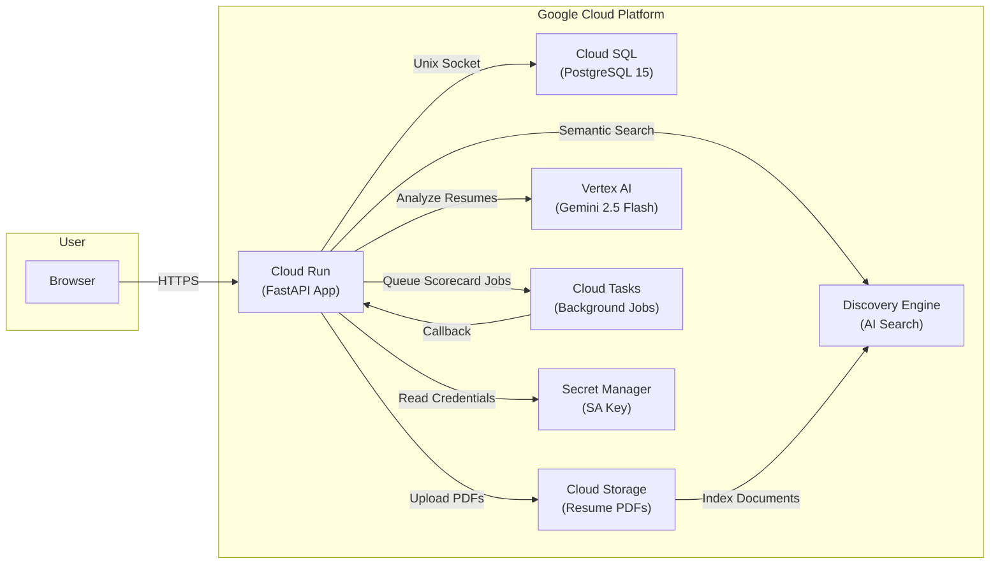

# 🚀 SmartHR — Full GCP Deployment Guide

---

## 📋 Table of Contents

1. [Prerequisites (What You Need Installed)](#1-prerequisites)
2. [Create a Google Cloud Account & Project](#2-create-a-google-cloud-account--project)
3. [Enable Billing](#3-enable-billing)
4. [Install the gcloud CLI](#4-install-the-gcloud-cli)
5. [Create a Service Account & Download Key](#5-create-a-service-account--download-key)
6. [Create a Discovery Engine Datastore (Manual)](#6-create-a-discovery-engine-datastore-manual)
7. [Configure Your Local Files](#7-configure-your-local-files)
8. [Run the One-Shot Deploy Script](#8-run-the-one-shot-deploy-script)
9. [Post-Deployment Verification](#9-post-deployment-verification)
10. [Troubleshooting](#10-troubleshooting)
11. [Cost Estimate](#11-cost-estimate)

---

## 🏗️ Architecture Overview

SmartHR connects **7 Google Cloud services** into a single, cohesive platform:



| Flow | Description |
|---|---|
| **Browser → Cloud Run** | User uploads resumes, searches candidates, views scorecards |
| **Cloud Run → Cloud SQL** | Reads/writes users, companies, search history, results |
| **Cloud Run → GCS** | Stores uploaded PDF/Docx files per-company bucket |
| **Cloud Run → Vertex AI** | Sends resume + JD to Gemini for scoring & entity extraction |
| **Cloud Run → Discovery Engine** | Indexes resumes and performs semantic search queries |
| **Cloud Run → Cloud Tasks** | Offloads long-running scorecard generation to a queue |
| **Cloud Tasks → Cloud Run** | Calls back with completed scorecard results |

---

## 1. Prerequisites

Before you begin, make sure the following tools are installed on your local machine:

| Tool | Purpose | Install Link |
|---|---|---|
| **Google Cloud SDK (gcloud CLI)** | Manage GCP resources | [Install Guide](https://cloud.google.com/sdk/docs/install) |
| **Docker Desktop** | Build container images | [Download](https://www.docker.com/products/docker-desktop/) |
| **Git** | Clone the repository | [Download](https://git-scm.com/downloads) |
| **psql** (optional) | Run database migrations locally | Comes with [PostgreSQL](https://www.postgresql.org/download/) |
| **Cloud SQL Auth Proxy** (optional) | Securely connect to Cloud SQL | [Download](https://cloud.google.com/sql/docs/postgres/sql-proxy) |

---

## 2. Create a Google Cloud Account & Project

### 2.1 Create a Google Cloud Account

1. Go to [https://console.cloud.google.com](https://console.cloud.google.com)
2. Sign in with your Google account (or create one)
3. If it's your first time, Google offers a **$300 free trial credit** for 90 days

### 2.2 Create a New Project

1. In the Google Cloud Console, click the **project selector dropdown** at the top of the page
2. Click **"New Project"**
3. Enter a **Project Name** (e.g., `smarthr-production`)
4. Note the auto-generated **Project ID** — you'll need this later (e.g., `smarthr-production-123456`)
5. Click **"Create"**

> [!IMPORTANT]
> Write down your **Project ID**. You will pass it to the deploy script.

---

## 3. Enable Billing

Most GCP services require an active billing account.

1. In the Console, go to **Navigation Menu (☰) → Billing**
2. Click **"Link a billing account"** or **"Create Account"**
3. Enter your payment details (credit/debit card). Google may place a small temporary hold to verify
4. Link the billing account to your project if prompted

> [!TIP]
> New accounts receive **$300 in free credits** — more than enough to test SmartHR.

---

## 4. Install the gcloud CLI

### Windows
```powershell
# Download the installer from:
# https://cloud.google.com/sdk/docs/install#windows
# Run the .exe installer and follow prompts
# Then open a NEW PowerShell/CMD window and run:
gcloud init
```

### macOS
```bash
# Using Homebrew:
brew install --cask google-cloud-sdk

# Or download from:
# https://cloud.google.com/sdk/docs/install#mac
gcloud init
```

### Linux (Debian/Ubuntu)
```bash
sudo apt-get update
sudo apt-get install apt-transport-https ca-certificates gnupg curl
curl https://packages.cloud.google.com/apt/doc/apt-key.gpg | sudo gpg --dearmor -o /usr/share/keyrings/cloud.google.gpg
echo "deb [signed-by=/usr/share/keyrings/cloud.google.gpg] https://packages.cloud.google.com/apt cloud-sdk main" | sudo tee -a /etc/apt/sources.list.d/google-cloud-sdk.list
sudo apt-get update && sudo apt-get install google-cloud-cli
gcloud init
```

### Verify Installation
```bash
gcloud version
# Should output something like: Google Cloud SDK 4xx.x.x
```

### Authenticate
```bash
gcloud auth login
# This opens a browser window — sign in with the same Google account
gcloud config set project YOUR_PROJECT_ID
```

---

## 5. Create a Service Account & Download Key

The deploy script needs a **Service Account JSON key** to authenticate with GCP services.

### 5.1 Create the Service Account

```bash
# Replace YOUR_PROJECT_ID with your actual project ID
gcloud iam service-accounts create smarthr-deployer \
  --display-name="SmartHR Deployer" \
  --project=YOUR_PROJECT_ID
```

### 5.2 Grant Required IAM Roles

SmartHR needs access to multiple GCP services. Grant all required roles:

```bash
PROJECT_ID=YOUR_PROJECT_ID
SA_EMAIL=smarthr-deployer@${PROJECT_ID}.iam.gserviceaccount.com

# Cloud Run (deploy and manage the app)
gcloud projects add-iam-policy-binding $PROJECT_ID \
  --member="serviceAccount:$SA_EMAIL" --role="roles/run.admin"

# Cloud SQL (database access)
gcloud projects add-iam-policy-binding $PROJECT_ID \
  --member="serviceAccount:$SA_EMAIL" --role="roles/cloudsql.client"

# Cloud Storage (resume file uploads)
gcloud projects add-iam-policy-binding $PROJECT_ID \
  --member="serviceAccount:$SA_EMAIL" --role="roles/storage.admin"

# Vertex AI (Gemini LLM access)
gcloud projects add-iam-policy-binding $PROJECT_ID \
  --member="serviceAccount:$SA_EMAIL" --role="roles/aiplatform.user"

# Discovery Engine (AI Search)
gcloud projects add-iam-policy-binding $PROJECT_ID \
  --member="serviceAccount:$SA_EMAIL" --role="roles/discoveryengine.editor"

# Secret Manager (store credentials)
gcloud projects add-iam-policy-binding $PROJECT_ID \
  --member="serviceAccount:$SA_EMAIL" --role="roles/secretmanager.admin"

# Cloud Tasks (background job processing)
gcloud projects add-iam-policy-binding $PROJECT_ID \
  --member="serviceAccount:$SA_EMAIL" --role="roles/cloudtasks.admin"

# Container Registry (push Docker images)
gcloud projects add-iam-policy-binding $PROJECT_ID \
  --member="serviceAccount:$SA_EMAIL" --role="roles/storage.admin"

# Service Account User (allows Cloud Run to use the SA)
gcloud projects add-iam-policy-binding $PROJECT_ID \
  --member="serviceAccount:$SA_EMAIL" --role="roles/iam.serviceAccountUser"
```

### 5.3 Download the JSON Key

```bash
gcloud iam service-accounts keys create service-account.json \
  --iam-account=smarthr-deployer@${PROJECT_ID}.iam.gserviceaccount.com
```

> [!CAUTION]
> **Never commit `service-account.json` to Git!** It is already in `.gitignore`. Keep this file secure.

### 5.4 Place the Key in the Project Root

```bash
# Move it to the SmartHR project root directory
mv service-account.json /path/to/smarthr/service-account.json
```

---

## 6. Create a Discovery Engine Datastore (Manual)

This is the **only step that cannot be fully automated** via the CLI. You need to create a Discovery Engine datastore for AI-powered resume search.

### Steps:

1. Go to [Agent Builder Console](https://console.cloud.google.com/gen-app-builder/data-stores) in your GCP project
2. Click **"Create Data Store"**
3. Select **"Cloud Storage"** as the data source
4. Choose **"Unstructured documents"**
5. Select or enter your GCS bucket (it will be named `YOUR_PROJECT_ID-resume-storage` after the deploy script runs — you can create the datastore after deployment too)
6. Give it a name like `smarthr-resume-datastore`
7. Click **"Create"**
8. **Copy the Datastore ID** from the datastore details page (it looks like `smarthr-resume-datastore_1234567890`)

> [!NOTE]
> If you create the datastore **after** running the deploy script, you can update the Cloud Run env var:
> ```bash
> gcloud run services update smarthr \
>   --region=us-central1 \
>   --update-env-vars="DATASTORE_ID=your_datastore_id_here"
> ```

> [!TIP]
> **Need help with this step?** If you are stuck creating the Discovery Engine datastore, please contact me through the **CodeCanyon support tab**. I will walk you through it personally or provide a recorded screen-share.

---

## 7. Configure Your Local Files

### 7.1 Service Account Key
Make sure `service-account.json` is in the project root (step 5.4 above).

### 7.2 Set Environment Variables
```bash
# Required — choose a strong password for the database
export DB_PASSWORD="your_secure_database_password"

# Optional — these have sensible defaults
export DB_USER="smarthr_user"      # default: smarthr_user
export DB_NAME="smarthr_db"        # default: smarthr_db

# Optional — if you already created the Discovery Engine datastore
export DATASTORE_ID="your_datastore_id_here"
```

### 7.3 Update config.json (Optional)
The deploy script injects most settings via environment variables. But if you want to customize `config.json` for local development:
```bash
cp service-account.example.json service-account.json
# Edit config.json with your project ID and bucket name
```

---

## 8. Run the One-Shot Deploy Script

### From the Project Root Directory:

```bash
# Make sure Docker Desktop is running!
# Make sure you're authenticated: gcloud auth login

bash deploy/deploy-gcp.sh YOUR_PROJECT_ID us-central1
```

### What the Script Does (11 Steps):

| Step | Action | GCP Service |
|---|---|---|
| 1 | Set active GCP project | gcloud |
| 2 | Enable 8 required APIs | Cloud Run, SQL, Storage, Vertex AI, etc. |
| 3 | Create Cloud SQL PostgreSQL 15 instance + database + user | Cloud SQL |
| 4 | Run `schema.sql` to create all tables (if `cloud-sql-proxy` installed) | Cloud SQL |
| 5 | Create GCS bucket for resume storage | Cloud Storage |
| 6 | Create Cloud Tasks queue for background processing | Cloud Tasks |
| 7 | Authenticate Docker with Google Container Registry | GCR |
| 8 | Build Docker image (linux/amd64) | Docker |
| 9 | Push image to Google Container Registry | GCR |
| 10 | Store service account key in Secret Manager | Secret Manager |
| 11 | Deploy to Cloud Run with all env vars & Cloud SQL connection | Cloud Run |

### Expected Duration:
- **Cloud SQL instance creation**: ~5-10 minutes (first time only)
- **Docker build**: ~3-5 minutes
- **Total first deployment**: ~15-20 minutes
- **Subsequent deployments**: ~5-8 minutes (Cloud SQL already exists)

---

## 9. Post-Deployment Verification

After the script completes, it prints the live URL. Verify everything works:

### 9.1 Check the App
```bash
# Get the service URL
gcloud run services describe smarthr --region=us-central1 --format='value(status.url)'

# Test the health endpoint
curl https://YOUR_CLOUD_RUN_URL/health
```

### 9.2 Default Login Credentials
```
Email:    admin@yourcompany.com
Password: admin123
```

> [!WARNING]
> **Change the default admin password immediately** after first login!

### 9.3 Check Logs
```bash
gcloud beta run services logs tail smarthr --region=us-central1
```

### 9.4 Connect to Database (Debug)
```bash
gcloud sql connect smarthr-db --user=smarthr_user --database=smarthr_db
```

---

## 10. Troubleshooting

### ❌ "Cloud SQL instance creation failed"
- Make sure billing is enabled on your project
- The `db-f1-micro` tier requires billing. Free Trial credits work fine

### ❌ "Docker build fails"
- Ensure Docker Desktop is **running** before starting the script
- On macOS/Windows, ensure Docker has enough memory (≥4GB recommended)

### ❌ "Permission denied" errors
- Verify all IAM roles from Step 5.2 are granted
- Run `gcloud auth login` again if your token expired

### ❌ "Schema migration skipped"
- Install `cloud-sql-proxy`: [Download](https://cloud.google.com/sql/docs/postgres/sql-proxy)
- Run migrations manually:
  ```bash
  cloud-sql-proxy YOUR_PROJECT_ID:us-central1:smarthr-db --port=5433 &
  PGPASSWORD=$DB_PASSWORD psql -h 127.0.0.1 -p 5433 -U smarthr_user -d smarthr_db -f deploy/schema.sql
  ```

### ❌ "App deploys but resumes don't upload"
- Make sure the GCS bucket was created (Step 5 of the script)
- Check that the service account has `roles/storage.admin`

### ❌ "AI Search returns no results"
- You need to create the Discovery Engine Datastore (Section 6)
- Update the `DATASTORE_ID` env var on Cloud Run

---

## 11. Cost Estimate

SmartHR uses the following billable GCP services:

| Service | Tier / Config | Estimated Monthly Cost |
|---|---|---|
| **Cloud Run** | 2 vCPU, 2GB RAM, min 1 instance | ~$15-40 |
| **Cloud SQL** | db-f1-micro (shared vCPU, 0.6GB) | ~$10 |
| **Cloud Storage** | Standard, pay per GB stored | ~$0.02/GB |
| **Vertex AI (Gemini)** | Pay per token (input/output) | ~$5-50 (usage dependent) |
| **Discovery Engine** | Pay per query / document | ~$5-20 |
| **Cloud Tasks** | Free tier covers most usage | ~$0 |
| **Secret Manager** | Free tier covers most usage | ~$0 |

**Estimated total: $35-120/month** depending on usage volume.

> [!TIP]
> New GCP accounts get **$300 free credits** for 90 days — enough for several months of testing.

---

## 📂 Files in This Directory

| File | Purpose |
|---|---|
| `deploy-gcp.sh` | One-shot deployment script (11 steps) |
| `schema.sql` | PostgreSQL table definitions for all 11 tables |
| `README.md` | This deployment guide |

---

## ✅ Quick Reference Checklist

```
Before running the script, make sure you have:

[ ] Google Cloud account with billing enabled
[ ] gcloud CLI installed and authenticated (gcloud auth login)
[ ] Docker Desktop installed and running
[ ] GCP Project created (note the Project ID)
[ ] Service Account created with all IAM roles
[ ] service-account.json downloaded and placed in project root
[ ] DB_PASSWORD environment variable set
[ ] (Optional) Discovery Engine Datastore created
[ ] (Optional) cloud-sql-proxy installed for schema migrations
```
